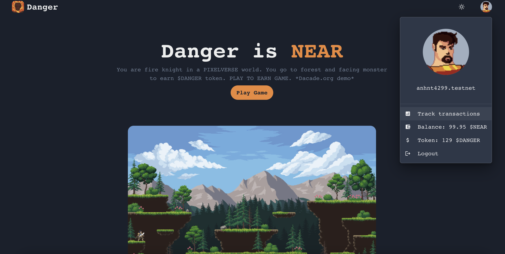
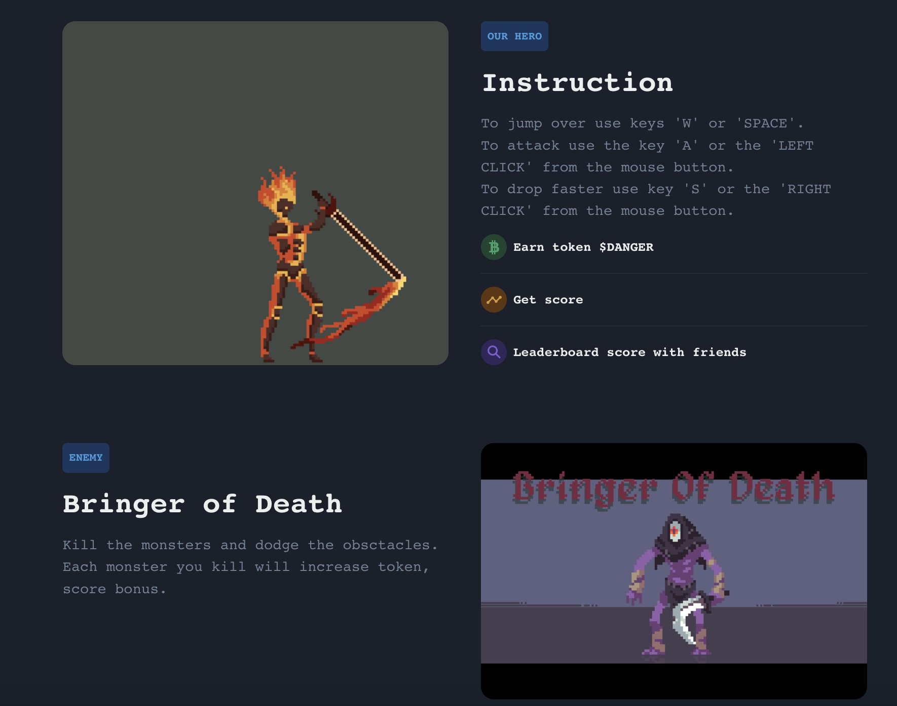
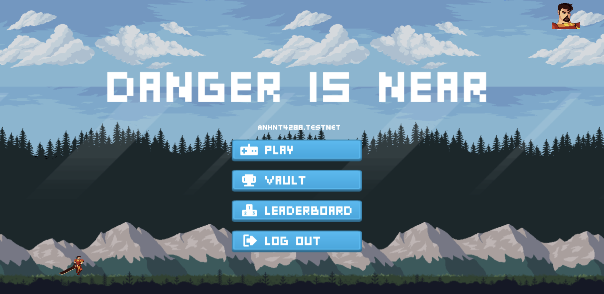
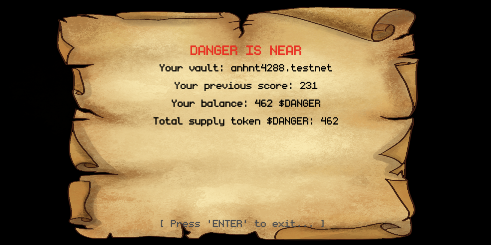
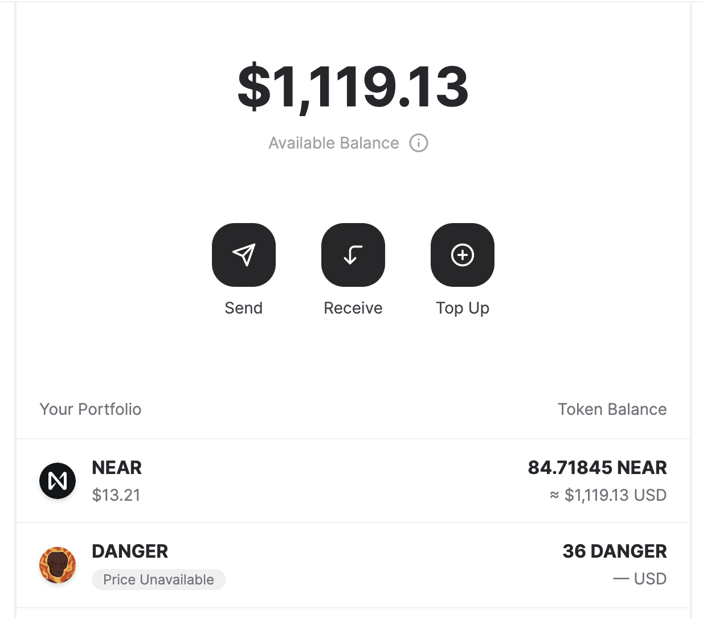
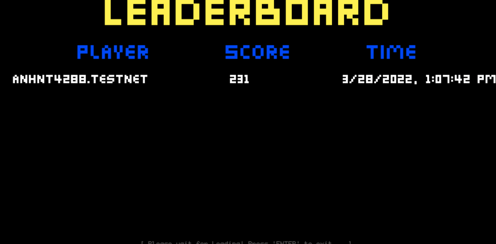
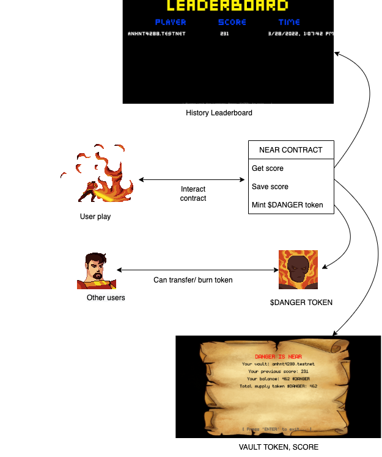

# Danger is near

## 📄 Overview

Danger is near (play to earn game, gamefi) - user play as a fireknight who go to forest and kill monster. User can earn $DANGER token and score to compete with others user.

- The contract code lives in the `/assembly` folder. 
- The game made by phaser framework

Both contract and client-side code will auto-reload as you change source files.
The contract get/save user score & using OpenBlimp library to implementation of the NEAR Fungible Token Standard, consisting of:
- NEP-141 Core: [NEP141](https://github.com/near/NEPs/blob/master/specs/Standards/FungibleToken/Core.md)
- NEP-145 Storage Management: [NEP145](https://github.com/near/NEPs/blob/master/specs/Standards/StorageManagement.md)
- NEP-148 Metadata: [NEP148](https://github.com/near/NEPs/blob/master/specs/Standards/FungibleToken/Metadata.md)

The demo from challenge Dacade courses "NEAR Development 101": [https://dacade.org/communities/near/courses/near-101/]

- [Demo Website](https://danger-is-near.vercel.app/).   
You can signup here to learn and earn crypto: https://dacade.org/signup?invite=anhfellow

## Technology stack

- `Next.js`
- `Near SDK`
- `OpenBlimp`
- `ChakraUI`
- `Phaser`

## Screenshots

- **Home Page**
  
  
- **Game play**
  
- **User Vault**
  
- **Wallet Token**
  
- **Leaderboard**
  
- **GameplayOverview**
  

## Installing

To run this project locally:

1. Prerequisites: Make sure you have Node.js ≥ 12 installed (https://nodejs.org), then use it to install [yarn]: `npm install --global yarn` (or just `npm i -g yarn`)
2. Run the local development server: `yarn && yarn dev` (see `package.json` for a
   full list of `scripts` you can run with `yarn`)

Now you'll have a local development environment backed by the NEAR TestNet! Running `yarn start` will tell you the URL you can visit in your browser to see the app.

## Build and deploy your contract

1. Build the smart contract:
   `yarn build:contract`
2. Deploy the smart contract
   ` near deploy --acountId=<testnet account near> --wasmFile=out/main.wasm `
3. (Optional) In the `assembly/index.ts` file, you can modify the function ft_initialize` to replace the stub parameters with your own parameters.
4. Use near-cli to initialize your fungible token
   `near call <Your Contract Account> ft_initialize --account-id <Your Near Test Account Id>`
   (In the scripts folder you can find some files with a lot of useful commands.)
5. Mint some token in your address: `near call $CONTRACT ft_mint '{"account":$ID_ACCOUNT,"amount":"100"}' --account-id $ID_ACCOUNT`
6. Launch your Near wallet and begin interacting with your new token.
7. Set contract name in code
Modify the line in `src/config.js` that sets the account name of the contract. Set it to the account id you used above.
    const CONTRACT_NAME = process.env.CONTRACT_NAME || 'your-contract-here!'
